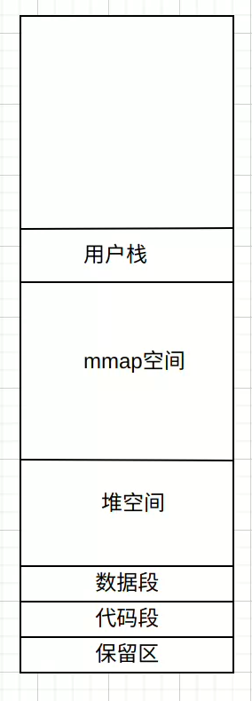

# [brk](http://gitlab.esuoyanyu.com/kernel/common/-/tree/main/mm/mmap.c)
```
malloc, 以M_MMAP_THRESHOLD(128K-64M)为阈值，小块内存使用brk系统调用，大块内存使用mmap系统调用，私有匿名映射的方法分配内存。
start_brk:堆空间起始地址。
brk:堆当前的位置
```

```
SYSCALL_DEFINE1(brk, unsigned long, brk)
{
	unsigned long newbrk, oldbrk, origbrk;
	struct mm_struct *mm = current->mm;
	struct vm_area_struct *next;
	unsigned long min_brk;
	bool populate;
	bool downgraded = false;
	LIST_HEAD(uf);

	if (mmap_write_lock_killable(mm))
		return -EINTR;

	origbrk = mm->brk;

#ifdef CONFIG_COMPAT_BRK
	/*
	 * CONFIG_COMPAT_BRK can still be overridden by setting
	 * randomize_va_space to 2, which will still cause mm->start_brk
	 * to be arbitrarily shifted
	 */
	if (current->brk_randomized)
		min_brk = mm->start_brk;
	else
		min_brk = mm->end_data;
#else
	min_brk = mm->start_brk;
#endif
	if (brk < min_brk)
		goto out;

	/*
	 * Check against rlimit here. If this check is done later after the test
	 * of oldbrk with newbrk then it can escape the test and let the data
	 * segment grow beyond its set limit the in case where the limit is
	 * not page aligned -Ram Gupta
	 */
	if (check_data_rlimit(rlimit(RLIMIT_DATA), brk, mm->start_brk,
			      mm->end_data, mm->start_data))
		goto out;

	//堆空间新的边界
	newbrk = PAGE_ALIGN(brk);
	oldbrk = PAGE_ALIGN(mm->brk);
	if (oldbrk == newbrk) {
		mm->brk = brk;
		goto success;
	}

	/*
	 * Always allow shrinking brk.
	 * __do_munmap() may downgrade mmap_lock to read.
	 */
	//如果新空间的边界小于小于当前堆空间的边界，则是释放内存
	if (brk <= mm->brk) {
		int ret;

		/*
		 * mm->brk must to be protected by write mmap_lock so update it
		 * before downgrading mmap_lock. When __do_munmap() fails,
		 * mm->brk will be restored from origbrk.
		 */
		mm->brk = brk;
		ret = __do_munmap(mm, newbrk, oldbrk-newbrk, &uf, true);
		if (ret < 0) {
			mm->brk = origbrk;
			goto out;
		} else if (ret == 1) {
			downgraded = true;
		}
		goto success;
	}

	/* Check against existing mmap mappings. */
	//查找是有有vma和当前堆地址重合
	next = find_vma(mm, oldbrk);
	//查看新的地址和mmap区之间是否还能够分配一页空间。
	if (next && newbrk + PAGE_SIZE > vm_start_gap(next))
		goto out;

	/* Ok, looks good - let it rip. */
	//分配新的vma，并填充。
	if (do_brk_flags(oldbrk, newbrk-oldbrk, 0, &uf) < 0)
		goto out;
	mm->brk = brk;

success:
	populate = newbrk > oldbrk && (mm->def_flags & VM_LOCKED) != 0;
	if (downgraded)
		mmap_read_unlock(mm);
	else
		mmap_write_unlock(mm);
	userfaultfd_unmap_complete(mm, &uf);
	//如果设置了VM_LOCKED标志，则通过缺页中断的方式立即分配内存。
	if (populate)
		mm_populate(oldbrk, newbrk - oldbrk);
	return brk;

out:
	mmap_write_unlock(mm);
	return origbrk;
}
```

## [do_brk_flags](http://gitlab.esuoyanyu.com/kernel/common/-/blob/main/mm/mmap.c)
```
static int do_brk_flags(unsigned long addr, unsigned long len, unsigned long flags, struct list_head *uf)
{
	struct mm_struct *mm = current->mm;
	struct vm_area_struct *vma, *prev;
	struct rb_node **rb_link, *rb_parent;
	pgoff_t pgoff = addr >> PAGE_SHIFT;
	int error;
	unsigned long mapped_addr;

	/* Until we need other flags, refuse anything except VM_EXEC. */
	if ((flags & (~VM_EXEC)) != 0)
		return -EINVAL;
	flags |= VM_DATA_DEFAULT_FLAGS | VM_ACCOUNT | mm->def_flags;

	mapped_addr = get_unmapped_area(NULL, addr, len, 0, MAP_FIXED);
	if (IS_ERR_VALUE(mapped_addr))
		return mapped_addr;

	error = mlock_future_check(mm, mm->def_flags, len);
	if (error)
		return error;

	/* Clear old maps, set up prev, rb_link, rb_parent, and uf */
	if (munmap_vma_range(mm, addr, len, &prev, &rb_link, &rb_parent, uf))
		return -ENOMEM;

	/* Check against address space limits *after* clearing old maps... */
	if (!may_expand_vm(mm, flags, len >> PAGE_SHIFT))
		return -ENOMEM;

	if (mm->map_count > sysctl_max_map_count)
		return -ENOMEM;

	if (security_vm_enough_memory_mm(mm, len >> PAGE_SHIFT))
		return -ENOMEM;

	/* Can we just expand an old private anonymous mapping? */
	vma = vma_merge(mm, prev, addr, addr + len, flags,
			NULL, NULL, pgoff, NULL, NULL_VM_UFFD_CTX, NULL);
	if (vma)
		goto out;

	/*
	 * create a vma struct for an anonymous mapping
	 */
	vma = vm_area_alloc(mm);
	if (!vma) {
		vm_unacct_memory(len >> PAGE_SHIFT);
		return -ENOMEM;
	}

	vma_set_anonymous(vma);
	vma->vm_start = addr;
	vma->vm_end = addr + len;
	vma->vm_pgoff = pgoff;
	vma->vm_flags = flags;
	vma->vm_page_prot = vm_get_page_prot(flags);
	vma_link(mm, vma, prev, rb_link, rb_parent);
out:
	perf_event_mmap(vma);
	mm->total_vm += len >> PAGE_SHIFT;
	mm->data_vm += len >> PAGE_SHIFT;
	if (flags & VM_LOCKED)
		mm->locked_vm += (len >> PAGE_SHIFT);
	vma->vm_flags |= VM_SOFTDIRTY;
	return 0;
}
```
